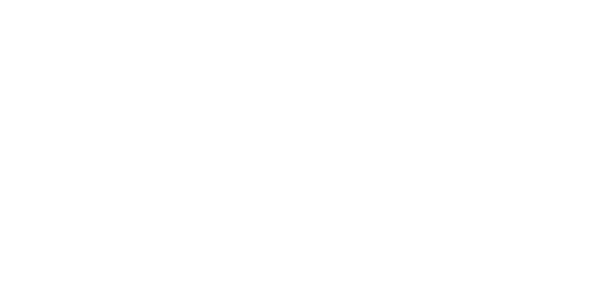

> **"Markdown to Web, from zero to hero."**

MarkZero es un motor de traducción de **Markdown a HTML** hecho 100% en Python puro, sin librerías externas de terceros. Fue creado como un reto personal para dominar la lógica de autómatas, expresiones regulares (Regex) y manejo de estados en el procesamiento de texto.

---

## ¿Qué hace especial a MarkZero?
- **Zero Dependencies:** Lógica pura, sin `markdown`, `beautifulsoup` ni nada extra. Solo Python y mucha logica.
- **State Engine:** Capaz de entender bloques complejos como listas, citas y bloques de código.
- **Dark Mode Native:** Genera sitios con un diseño oscuro integrado.
- **SEO Ready:** Estructura semántica correcta (H1-H6).

---

## Características implementadas (Día 1)
- [x] **Encabezados:** Niveles del 1 al 6.
- [x] **Estilo de Texto:** Negritas (`**`), Cursivas (`*`), Resaltado (`==`) y Código en línea (`` ` ``).
- [x] **Listas:** Soporte para listas sin ordenar (`-`).
- [x] **Citas:** Bloques de cita (`>`) con soporte para líneas múltiples.
- [x] **Multimedia:** Enlaces e Imágenes con sintaxis estándar.
- [x] **Código:** Bloques de código con triple backtick (`` ``` ``).

---

##  Instalación y Uso
1. Clona este repositorio:
   ```bash
   git clone https://github.com/cerrtrash/MarkZero.git
   ```
2. Pon tus notas en un en la carpeta files, se veria asi:  `files/nombre_generico.md` (o cambia el nombre en el script).
3. Ejecuta el motor:
   ```bash
   python main.py
   ```
4. ¡Listo! Abre tu `index.html` y disfruta de la magia.

---

## Estado del Proyecto
#### **MarkZero está en desarrollo.**
Todavía está muy lejos de ser la herramienta final que imagino. Siente libre de clonar mi repositorio y seguir por tu cuenta, agregando cosas, mejorando otras o aplicando buenas prácticas. 

> **Nota:** Este es un proyecto personal de aprendizaje. **No se aceptarán Pull Requests** por el momentO.

---

## Autor
Desarrollado con <3 y mucha paciencia por **[cerrtrash(pagina en desarrollo)](https://link.bydaniel.site)**.

---
*Dicho eso, ¡que tengas un excelente día de código!*
